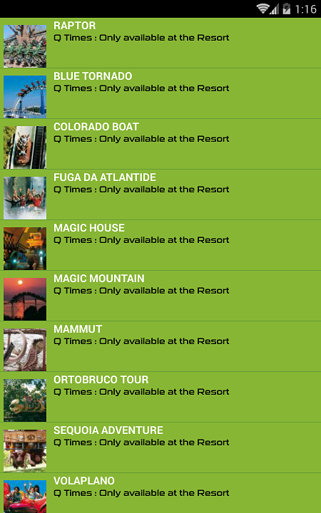
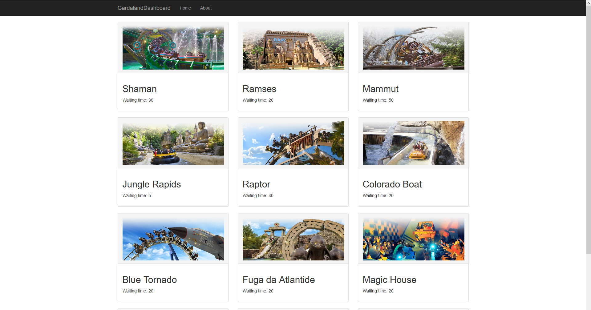
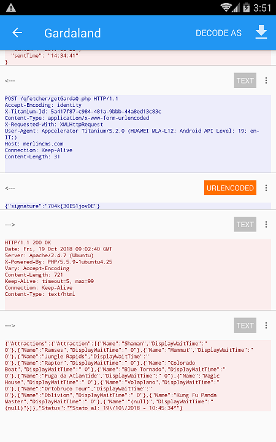

## GardalandDashboard
Show in real time the **[Gardaland Park](https://www.gardaland.it/)** attractions waiting time.

## Motivation
This project was created because there is no way to know the **[Gardaland Park](https://www.gardaland.it/)** attractions waiting time if you aren't inside the park.
If you open the official [App](https://play.google.com/store/apps/details?id=com.merlin.gardaland&hl=it) and you are
outside the park this is what you get:

## Screenshots

## Tech/framework used

<b>Built with</b>
- [.NET Core 2.1 SDK](https://github.com/dotnet/core/blob/master/release-notes/2.1/README.md)
- [BootStrap](https://startbootstrap.com/)

## Installation
Simply build and run the `GardalandDashboard.sln` solution.

## Step by step guide
- Download and install [NoxPlayer](https://www.bignox.com/) Android emulator.
- Run it.
- Install [Gardaland Resort Official App](https://play.google.com/store/apps/details?id=com.merlin.gardaland&hl=it) from GooglePlay.
- Install [SSL Capture](https://play.google.com/store/apps/details?id=com.minhui.networkcapture) or similar packet sniffer app.
- Set on **NoxPlayer** location settings the following coordinates: "**Lat 45.456863**, **Long 10.713501**" or put in the top search bar "Gardaland Park".
- Start **SSL Capture** app.
- Start **Gardaland Resort Official App** and open the "**Q-Times**" section.
- Go back to **SSL Capture** app and find the request to the endpoint.
 
- Get the signature parameter that is used to validate the call.
- Put it on the `appsettings.json` file.

## Contribute
- Report any issues
- Propose new features / improvements / telling your opinion.

## License
Permission is hereby granted, free of charge, to any person obtaining a copy of this software and associated documentation files (the "Software"), to deal in the Software without restriction, including without limitation the rights to use, copy, modify, merge, publish, distribute, sublicense, and/or sell copies of the Software, and to permit persons to whom the Software is furnished to do so, subject to the following conditions:

The above copyright notice and this permission notice shall be included in all copies or substantial portions of the Software.

THE SOFTWARE IS PROVIDED "AS IS", WITHOUT WARRANTY OF ANY KIND, EXPRESS OR IMPLIED, INCLUDING BUT NOT LIMITED TO THE WARRANTIES OF MERCHANTABILITY, FITNESS FOR A PARTICULAR PURPOSE AND NONINFRINGEMENT. IN NO EVENT SHALL THE AUTHORS OR COPYRIGHT HOLDERS BE LIABLE FOR ANY CLAIM, DAMAGES OR OTHER LIABILITY, WHETHER IN AN ACTION OF CONTRACT, TORT OR OTHERWISE, ARISING FROM, OUT OF OR IN CONNECTION WITH THE SOFTWARE OR THE USE OR OTHER DEALINGS IN THE SOFTWARE.